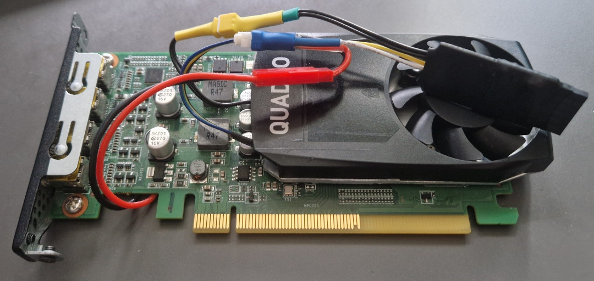
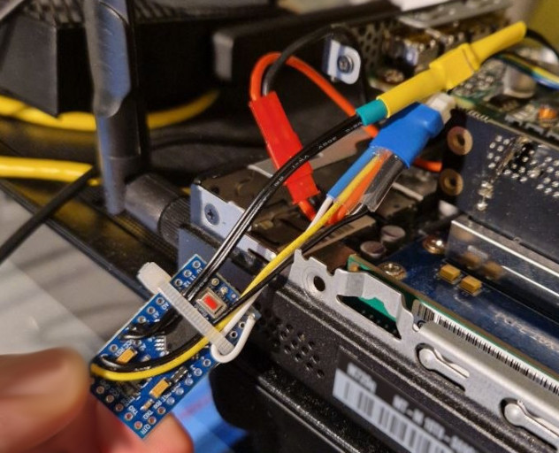

# Arduino GPU Fan Controller (NTC 10K)

An intelligent thermal management system for cooling electronics (like GPUs or power supplies) using an Arduino UNO and an NTC 10K thermistor. This project implements a precise temperature-to-PWM control curve with built-in failsafes and hysteresis.

## 🚀 Features

- **Precision Thermal Control**: Uses a linear interpolation algorithm to map temperature to PWM duty cycle based on a customizable fan curve.
- **NTC 10K Thermistor Integration**: Specifically tuned for NTC 10K $\beta=3435$ thermistors.
- **Smart Hysteresis**: Prevents rapid fan speed oscillations by implementing a temperature hysteresis buffer.
- **Advanced Failsafes**:
    - **Sensor Error Detection**: If the thermistor is disconnected or shorted, the fan immediately ramps to 100% speed.
    - **Watchdog Timer (WDT)**: Hardware-level protection to reset the Arduino if the software hangs.
- **Startup Test Sequence**: Performs a visual and audible "ramp up/down" test on boot to verify fan and controller functionality.
- **Real-time Debugging**: Outputs voltage, stabilized temperature, current temperature, and PWM percentage via Serial Monitor.

## 🛠 Hardware Requirements

- **Microcontroller**: Arduino UNO (or any ATmega328P based board).
- **Thermistor**: NTC 10K $\beta=3435$.
- **Fan**: 4-pin PC PWM Fan (12V).
- **Resistor**: 10k $\Omega$ (for NTC voltage divider).
- **LED**: Standard LED + 220 $\Omega$ resistor (for status/error signaling).
- **Power Supply**: 12V DC (for the fan).
- **Breadboard & Jumper Wires**.

## 🔌 Connection Scheme

> [!IMPORTANT]
> **Do not power a 12V PC fan directly from the Arduino 5V pin.** You must use an external 12V power supply and ensure the grounds (GND) are connected.

### 1. Temperature Sensor (NTC Divider)
| NTC Component               | Arduino Pin | Note                    |
|:----------------------------|:------------|:------------------------|
| Thermistor End 1            | **5V**      |                         |
| Thermistor End 2            | **A3**      | Junction point          |
| 10k $\Omega$ Resistor End 1 | **A3**      | Pull-down configuration |
| 10k $\Omega$ Resistor End 2 | **GND**     |                         |

### 2. 4-Pin PC Fan
| Fan Pin          | Connection  | Note                                        |
|:-----------------|:------------|:--------------------------------------------|
| **Pin 1 (GND)**  | **GND**     | Connect to both Arduino GND and 12V PSU GND |
| **Pin 2 (12V)**  | **12V (+)** | From external 12V Power Supply              |
| **Pin 3 (Tach)** | *Not Used*  | Speed feedback pin                          |
| **Pin 4 (PWM)**  | **Pin 9**   | PWM signal from Arduino                     |

### 3. Status LED
| Component           | Connection   | Note                      |
|:--------------------|:-------------|:--------------------------|
| **LED Anode (+)**   | **Pin 13**   | Via 220 $\Omega$ resistor |
| **LED Cathode (-)** | **GND**      |                           |

## 📈 Fan Curve Configuration

The fan speed is determined by the following mapping in the code:

| Temperature (°C) | PWM Duty Cycle (%) |
|:-----------------|:-------------------|
| $\le$ 39.9°C     | 0% (Fan OFF)       |
| 40.0°C           | 10%                |
| 50.0°C           | 30%                |
| 70.0°C           | 60%                |
| $\ge$ 80.0°C     | 100%               |

*Note: The fan only starts if the temperature exceeds the `TEMP_START_SHIFT` (45°C) to prevent frequent starts/stops near the threshold.*

## 💻 Software Implementation Details

### Mathematical Model
The temperature is calculated using the Beta equation:
$$T_{Kelvin} = \frac{1}{\frac{1}{T_0} + \frac{1}{B} \cdot \ln(\frac{R_{ntc}}{R_0})}$$

### Safety Logic
- **Watchdog**: The code calls `wdt_reset()` frequently. If the loop hangs for more than 2 seconds, the hardware resets.
- **Error State**: If `analogRead` detects a voltage outside the expected range ($<0.1\text{V}$ or $>4.9\text{V}$), the LED blinks rapidly and the fan is forced to 100%.

## ⚙️ Setup & Usage

1. Connect the hardware as described in the Connection Scheme.
2. Open `GPU_Fan_Controller_NTC10KB3435.ino` in the Arduino IDE.
3. Select **Arduino UNO** from the Board Manager.
4. Upload the code.
5. Open the **Serial Monitor** (set to `9600` baud) to observe real-time telemetry.

## 📜 License
This project is open-source. Feel free to modify it for your specific thermal needs!
